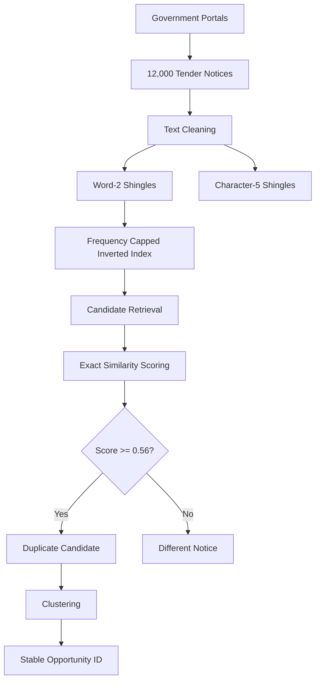

# SetuBid Tender Deduplication

Advanced Data Mining project work for **Q2: SetuBid Tender Deduplication**.


## 🔄 System Workflow




## Overview

Public procurement notices are often republished across multiple government portals. The same tender may have different portal reference numbers, date formats, monetary formats, publication dates, or wording on each copy. SetuBid identifies likely duplicate notices while treating false merges as substantially more costly than missed duplicates.

The measured system uses cleaned text representations, sublinear candidate retrieval, exact candidate scoring, clustering, and stable opportunity identities.

## Problem

The evaluated corpus contains:

- **12,000** procurement notices
- **260** portals
- **900** labelled notice pairs
- **279 SAME** pairs
- **621 DIFFERENT** pairs
- False merge cost set to **10x** the cost of a missed duplicate
- Nightly processing target of **under 20 minutes** on one machine

## Approach

1. Clean case, whitespace, reference-number, date, money, and known aggregator-boilerplate variation.
2. Represent titles with word-2-shingles.
3. Represent bodies with character-5-shingles for robust wording similarity.
4. Combine title and body similarities with weighted Jaccard similarity.
5. Compare reduced MinHash representations and select a measured **1024-component** estimator.
6. Build a frequency-capped inverted index, allowing tokens from at most **60 notices**, or **0.5%** of the corpus.
7. Retrieve candidate notice pairs without comparing every possible pair.
8. Score candidates with the exact similarity representation.
9. Cluster accepted matches and assign deterministic, stable opportunity IDs.
10. Store the retrieval index in PostgreSQL and compare indexed lookup with a forced sequential scan.

## Similarity Model

```text
score = 0.35 * Jaccard(title word-2-shingles)
      + 0.65 * Jaccard(body character-5-shingles)
```

The measured decision threshold is:

```text
threshold = 0.56
```

Reference numbers, dates, and monetary strings are retained as notice fields but are not treated as direct identity keys. This reflects the portal behavior documented in `portal_profiles.md`.

## Key Results

| Measure | Result |
|---|---:|
| Notices | 12,000 |
| Portals | 260 |
| Labelled pairs | 900 |
| SAME / DIFFERENT labels | 279 / 621 |
| Candidate pairs | 1,482,078 |
| Labelled SAME-pair candidate survival | 100% |
| MinHash components | 1,024 |
| PostgreSQL posting rows | 95,467 |
| PostgreSQL distinct tokens | 11,509 |
| End-to-end runtime | 121.735 seconds |
| Nightly target | 1,200 seconds |

The recorded end-to-end run is below the 20-minute target. The clean representation preserved all labelled SAME pairs during candidate retrieval, but produced slightly more candidate work than the raw comparison in this corpus; that result is retained in the evidence rather than hidden.

## Database

The PostgreSQL retrieval structure is `q2.token_index`, containing the measured clean word-2-shingle posting list. The application lookup is an equality predicate on `token`:

```sql
SELECT notice_id
FROM q2.token_index
WHERE token = $1;
```

The selected B-tree index path was compared with a forced sequential scan using `EXPLAIN ANALYZE`:

| Access method | PostgreSQL plan | Time |
|---|---|---:|
| Selected | `Index Scan` using `q2_token_index_token_idx` | 0.038 ms |
| Rejected alternative | Forced `Seq Scan` | 3.146 ms |

The index is appropriate because an equality lookup can navigate directly to the matching posting list. A sequential scan examines the complete 95,467-row relation and filters rows one by one.

## Stable Identity

Opportunity IDs are not random per-run identifiers. An opportunity retains its persisted anchor, derived from the minimum persistent notice ID, and the card ID is formed as `OPP` plus that anchor.

The recorded append test passed: after adding notice `N999999`, existing card ID `OPP010018` remained `OPP010018`.

## Repository Structure

The current project files are organized as follows:

```text
.gitignore
.gitignore.save
labelled_pairs.csv
notices/
portal_profiles.md
_truth/
q2_corpus_profile.md
q2_database_design.md
q2_experiments.py
q2_final_answers.md
q2_final_answers_final.md
q2_postgres_benchmark.py
q2_results.md
q2_retrieval_experiments.md
q2_similarity_experiments.md
q2_skew_mitigation.md
q2_results/
  postgres_benchmark.json
  q2_index.sqlite
  raw_results.json
  plots/
    README.txt
    similarity_survival.svg
```

The `notices/` corpus and `_truth/` directory are included here because this project snapshot is intended to preserve the complete local Q2 working set. Treat these files as exam/project data and do not redistribute them outside the authorized repository.

## Performance

| Phase | Measured time |
|---|---:|
| Load and corpus profiling | 0.266 s |
| Label scoring | 3.005 s |
| Raw retrieval | 4.424 s |
| Clean retrieval | 10.005 s |
| Indexing and database work | 18.594 s |
| Candidate scoring | 44.343 s |
| Clustering | 0.043 s |
| End-to-end run | 121.735 s |
| Target | 1,200 s |

Candidate distribution for the clean retrieval pass was mean **123.507**, p50 **123**, p95 **194**, p99 **228**, and maximum **295** candidates per notice.

## Results and Evidence

- [Corpus profile](q2_corpus_profile.md)
- [Similarity experiments](q2_similarity_experiments.md)
- [Retrieval experiments](q2_retrieval_experiments.md)
- [Skew mitigation](q2_skew_mitigation.md)
- [Database design](q2_database_design.md)
- [PostgreSQL benchmark](q2_results/q2_database_benchmark.md)
- [Measured results summary](q2_results.md)
- [Audited final answers](q2_final_answers_final.md)
- [Raw experiment results](q2_results/raw_results.json)
- [PostgreSQL benchmark results](q2_results/postgres_benchmark.json)
- [Candidate-survival plot](q2_results/plots/similarity_survival.svg)

## Reproducibility

The main corpus analysis is implemented in `q2_experiments.py`. It reads the notice CSV files and `labelled_pairs.csv`, computes the representation and retrieval measurements, writes the reports, and stores raw JSON results.

The PostgreSQL verification is implemented in `q2_postgres_benchmark.py`. It loads the measured retrieval index into the local PostgreSQL container, creates the token index, and records indexed versus forced sequential `EXPLAIN ANALYZE` results. PostgreSQL must be available locally for that benchmark.

The reports are the best starting point for understanding the design decisions; the raw JSON files preserve the measured result payloads used in the summaries.

## Data Privacy

The original exam/question dataset is intentionally excluded from the published GitHub repository. The local working copy used for this project may contain the exam inputs needed to reproduce the recorded measurements, but those source notices and labels should not be committed or redistributed. The repository is intended to publish the code, design documentation, and derived evidence rather than the original exam corpus.
